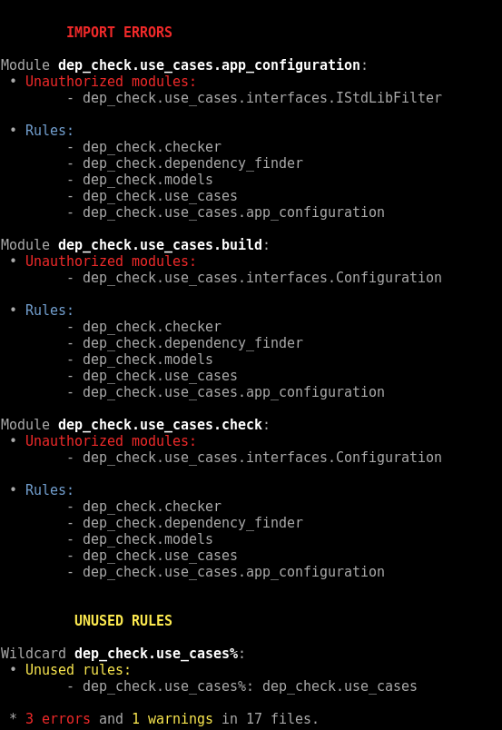
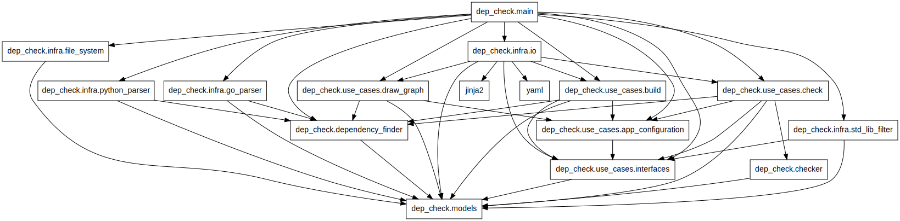
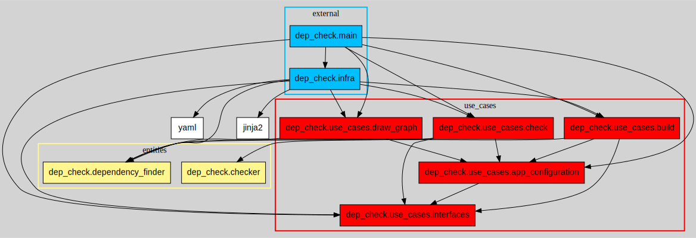
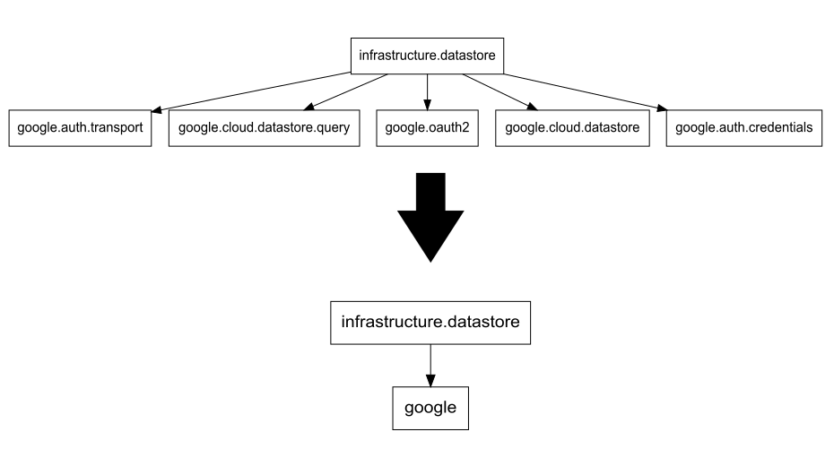

# User Manual

The supported languages are

* [Python](https://www.python.org/)
* [Golang](https://golang.org/)

By default, the tool assumes it's operating on a Python project.

## The configuration file

### Auto-build your configuration file

```sh
dep_check build <ROOT_DIR> [-o config.yaml] [--lang LANG]
```

Argument | Description | Optional | Default
-------- | ----------- | -------- | -------
ROOT_DIR | The project root directory, containing the source files | :x: | *N/A*
-o / --output | The output file (yaml format) | :heavy_check_mark: | dependency_config.yaml
--lang | The language the project is written in | :heavy_check_mark: | python

This command lists the imports of each module in a yaml file. Use this file as a starting point to write dependency rules on which module can import what, using wildcards.

Here is an example of additional rules added to the initial yaml file:

```yaml
---

dependency_rules:
'*':
    - dep_check.models
    - dep_check.dependency_finder
    - dep_check.checker

dep_check.infra.io:
    - dep_check.use_cases%
    - jinja2
    - yaml

dep_check.infra.std_lib_filter:
    - dep_check.use_cases.interfaces

dep_check.use_cases%:
    - dep_check.use_cases.app_configuration
    - dep_check.use_cases.interfaces

dep_check.main:
    - '*'

lang: python
local_init: false
```

### Write your own configuration file

You can build your own configuration file, using wildcards. Here are those supported by the application :

* `*` corresponds to any string, including an empty one
* `?` corresponds to any single character
* `[abc]` corresponds to any character among 'a', 'b' or 'c'
* `[d-y]` corresponds to any character between 'd' and 'y'
* `[!d-y]` corresponds to any character which is **not** between 'd' and 'y'
* `[!abc]` corresponds to any character except 'a', 'b' or 'c'
* Use `%` after a module name (e.g. `my_module%`) to include this module along with its sub-modules.

### Examples

```yaml
mymodule:
    - mymodule%
    - amodule.submodule.*
    - othermodul?_[0-9]
```

Here, the rules define that `mymodule` can import:

* `mymodule`
* `mymodule.anything.moduleagain`
* `amodule.submodule.somemodule`
* `othermodule_9`
* ...

Though, `mymodule` won't be able to import:

* `mymodule_07`
* `amodule`
* `amodule.submodule`
* `othermodule_9.module`

*Note : if a `*` is alone on a line, it has to be between quotes :*

```yaml
mymodule:
    - '*'
```

## Check your configuration

Once your config file is ready, run

```sh
dep_check check <ROOT_DIR> [-c config.yaml] [--lang LANG]
```

Argument | Description | Optional | Default
-------- | ----------- | -------- | -------
ROOT_DIR | The project root directory, containing the source files | :x: | *N/A*
-c / --config | The yaml file in which you wrote the dependency rules | :heavy_check_mark: | dependency_config.yaml
--lang | The language the project is written in | :heavy_check_mark: | python

The command reads the configuration file, and parses each source file. It then verifies, for each file, that every `import` is authorized by the rules defined in the configuration file.

When it's done, it writes a report on the console, listing import errors by module and unused rules:



## Draw a dependency graph

**You need to have graphviz installed to run this command**

```sh
dep_check graph <ROOT_DIR> [-o file.svg/dot] [-c config.yaml] [--lang LANG]
```

Argument | Description | Optional | Default
-------- | ----------- | -------- | -------
ROOT_DIR | The project root directory, containing the source files | :x: | *N/A*
-o / --output | The output file you want (svg or dot format) | :heavy_check_mark: | dependency_graph.svg
-c / --config | The graph configuration file containing options (yaml format) | :heavy_check_mark:| None
--lang | The language the project is written in | :heavy_check_mark: | python

*Note : if you generate a svg file, a dot file is created in `/tmp/graph.dot`*



### Add options

The graph you'll get may seem unreadable if your project is pretty big. If that's the case, add options to the graph you want to draw, using a YAML configuration file.

Here is a config example:

```yaml
layers:
    entities:
        color: khaki1
        modules:
        - dep_check.models
        - dep_check.dependency_finder
        - dep_check.checker

    use_cases:
        color: red
        modules:
        - dep_check.use_cases

    external:
        color: deepskyblue
        modules:
        - dep_check.infra
        - dep_check.main

bgcolor: lightgray

fold_modules:
- dep_check.infra

hide_modules:
- dep_check.models
```



Let's see each option in details:

#### Fold a module

You can chose to 'fold' one or more modules, which brings together all their sub-modules into the module(s), making the graph way more readable.

To do so, you'll have to add a "fold_modules" in your graph config file, e.g.:

```yaml
fold_modules:
    - google
```



#### Hide a module

You can also chose to hide entirely a module, which removes it from the dependency graph, along with its sub-modules.

To do so, you'll have to add a "hide_modules" in your graph config file:

```yaml
hide_modules:
    - root.amodule
```

**Make sure the name of the module you want to fold/hide start at the root of your project** (e.g. 'root.amodule' and not 'amodule')

#### Add color

You can change the nodes and/or background color of the graph, using 'node_color' and 'bgcolor' options: ([Here are the colors you can use](https://www.graphviz.org/doc/info/colors.html))

```yaml
node_color: crimson
bgcolor: gold
```

*Note: if not defined, the nodes are white and the background is transparent.*

#### Add layers

You can add layers to your graph, grouping modules as you want (e.g. according to Clean Architecture layers).

To do so, add a "layers" in your graph config file. Then for each layer you want, you have to inform the color of the nodes, and the list of modules in your layer.

*Note: each module you write here includes its sub-modules. If you write `root.module` in a layer's list of modules, all its sub-modules are added in the layer as well*

```yaml
layers:
    my_first_layer:
        color: green
        modules:
            - root.module.submodule
            - root.othermodule
    my_second_layer:
        color: blue
        modules:
            -root.amodule
```

The modules which are not in a layer are displayed normally.
